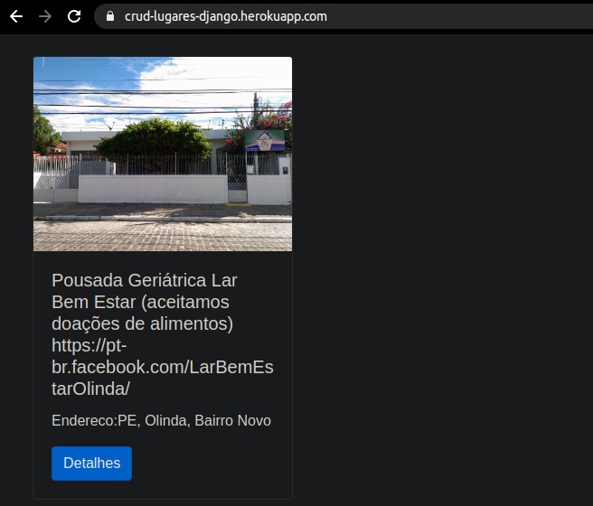

# crud_django (PT-BR)
## Projeto da disciplina de computação avancada
  - Crud com a finalidade de exibir uma ***POC(proof of concept***)
  - O projeto é um site em Django para cadastro de instituições que precisam de doações, afim de que pessoas possam encontrar estes lugares
  - Pode ver em https://crud-lugares-django.herokuapp.com/
 
# crud_django (EN-US)
## Advanced computing discipline project
   - Crud for the purpose of displaying a ***POC(proof of concept***)
   - The project is a site in Django to register institutions that need donations, so that people can find these places
   - Can see in https://crud-lugares-django.herokuapp.com/
  

  
